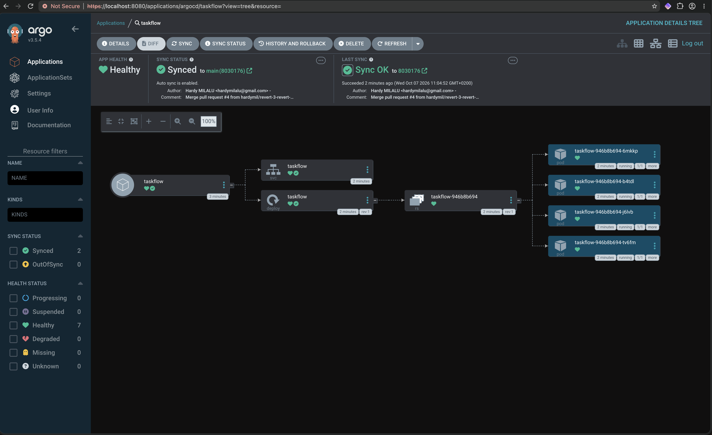
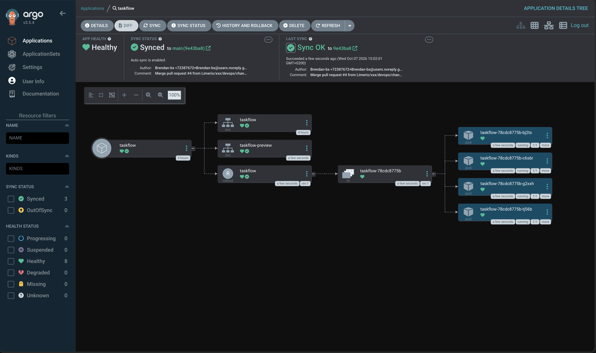
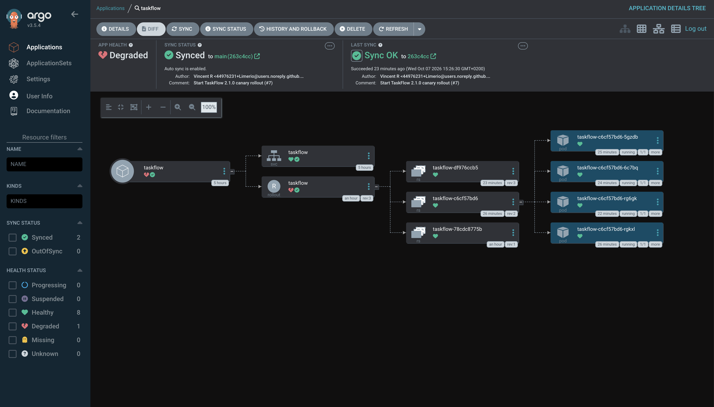

# taskflow-gitops — dépôt GitOps du cours CI/CD M2

Ce dépôt décrit **l'état voulu** de l'application TaskFlow dans Kubernetes.
Argo CD le surveille et aligne le cluster dessus : pour changer la production,
on ne tape pas de commande, on fait une **Pull Request**.

## Installation (à faire chez vous, avant le cours)

Prérequis : Docker Desktop démarré, 8 Go de RAM, 10 Go de disque libre.
Sous Windows : WSL2 (Ubuntu) + intégration WSL de Docker Desktop, et toutes les commandes dans WSL.

```bash
git clone https://github.com/9m7fjfpv9k-cyber/taskflow-gitops.git
cd taskflow-gitops
./scripts/install.sh
```

Le script crée un cluster local `kind`, installe Argo CD et Argo Rollouts,
puis télécharge les images des labs. Comptez 5 à 15 minutes.
Il peut être relancé sans risque.

## Structure

| Chemin | Rôle |
| --- | --- |
| `apps/taskflow/` | Les manifests surveillés par Argo CD |
| `argocd/application.yaml` | Déclare l'application dans Argo CD |
| `apps/taskflow/bluegreen/` | Manifests du déploiement Blue-Green suivis par Argo CD |
| `exemples/canary/` | Manifests pour le déploiement Canary |
| `exemples/robustesse/` | Canary avec test de charge k6 automatique, modèle de postmortem |
| `exemples/ci/` | Pipelines de la mini-PSSI (GitHub Actions et GitLab CI) |
| `policies/` | Mini-PSSI et règles Rego vérifiées par conftest |
| `scripts/install.sh` | Installation de l'environnement |
| `scripts/argocd-ui.sh` | Ouvre l'interface d'Argo CD |
| `scripts/observe.sh` | Montre quelle version répond, et avec quel code HTTP |
| `scripts/charge.sh` | Lance à la main le test de charge k6 contre un service |


## Images disponibles

`ghcr.io/9m7fjfpv9k-cyber/taskflow` en versions `1.0.0`, `1.1.0`, `2.0.0`, `2.1.0` et `2.2.0`.

## Équipe

- Vincent R
- Brendan B

## Result Mercredi Matin



Bonus answer: Quand on supprime le service.yaml par prune ArgoCD recréé directement la ressource.

## Mercredi Aprem

### Déploiement Blue-Green

Argo CD suit `apps/taskflow/bluegreen/`, qui contient le Rollout et les services `taskflow` et `taskflow-preview`. Le service `taskflow` sert la version active. Le service `taskflow-preview` sert la version candidate.

Pour lancer un déploiement, changez le tag de l’image dans `apps/taskflow/bluegreen/rollout.yaml`, puis fusionnez le changement dans `main`. Argo CD synchronise le Rollout et Argo Rollouts démarre les pods de la candidate. La promotion automatique est désactivée.

Observez les réponses de production et de la candidate :

```bash
./scripts/observe.sh taskflow
./scripts/observe.sh taskflow-preview
```

Quand la candidate est prête, faites la promotion et vérifiez le trafic de production :

```bash
kubectl argo rollouts promote taskflow -n taskflow
./scripts/observe.sh taskflow
```

La promotion fait basculer le service `taskflow` vers la candidate. La commande de promotion ne change pas le tag de l’image dans Git. Pour publier une autre version, modifiez le manifeste et fusionnez un nouveau changement.




L’abort ne modifie pas Git : le manifeste demande toujours 2.1.0, donc Argo CD reste **Synced / Degraded**. La prochaine étape est une PR de revert vers 2.0.0 pour retrouver **Healthy**.



## Jeudi Matin

### Test de charge 

